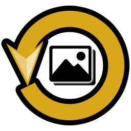

# ImageConverter
A very customizable program to convert images to different image formats: jpeg, jpg, png, ico, cur, bmp, gif and tiff

## Future nice to haves/refactorings
- [ ] Modify the metadata of the image to convert
- Fix conversion to gif, sometimes the final gifs are buggy
- Option to set a transparency color(chroma keying) when converting 24bpp BMPs to ICO
- Extract individual GIF frames when converting to other formats

## Minimum PC requirements:
- 150MB of ram(Depends on the size of the images to convert)
- ~400Kb of free disk space 
- .NET framework 4.7.1 or higher

### Your antivirus might flag the software as a virus because it lacks a digital signature  

